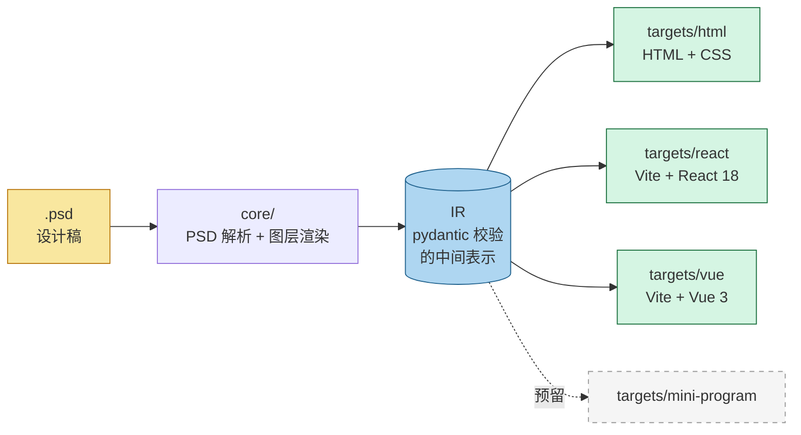
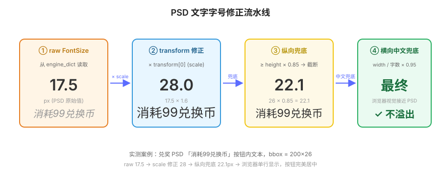
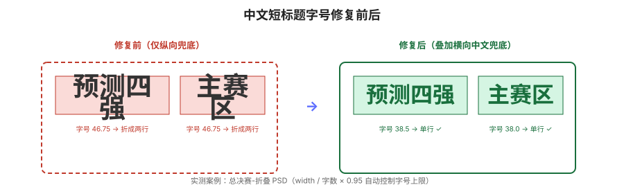
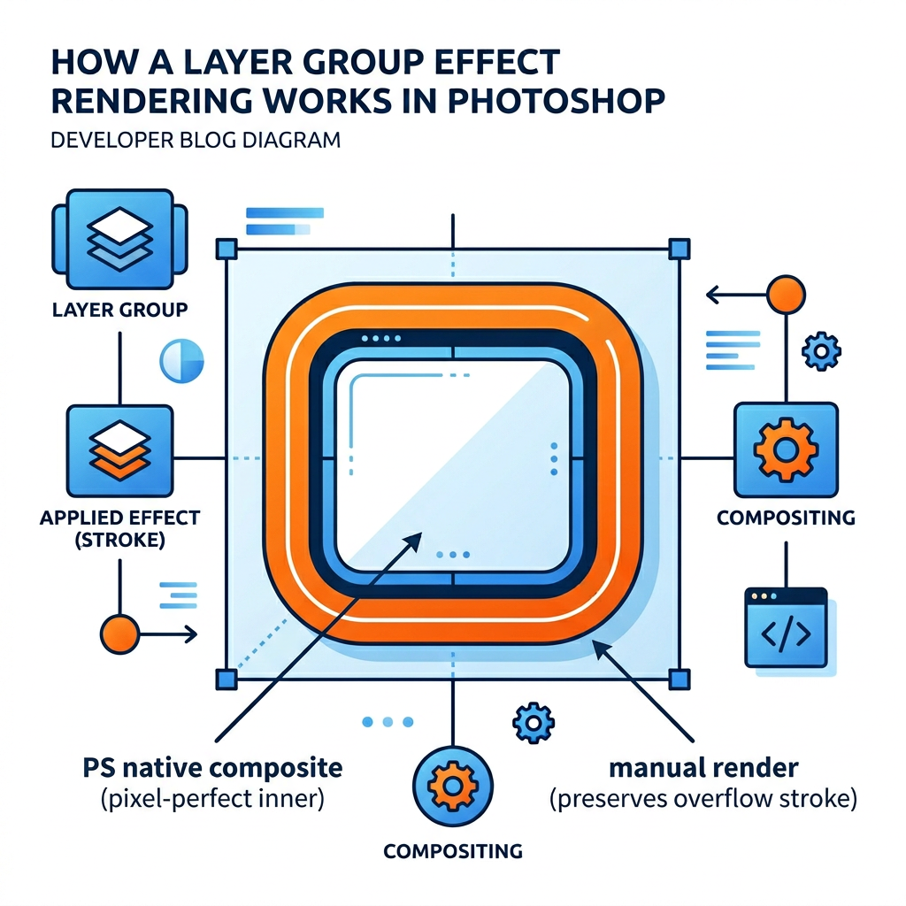
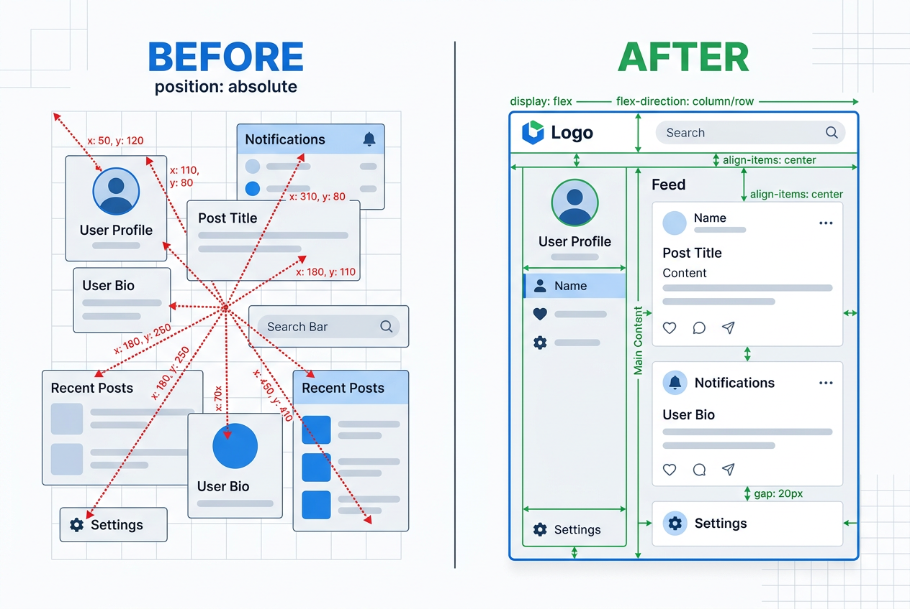
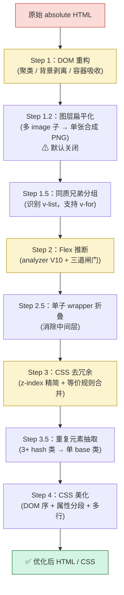
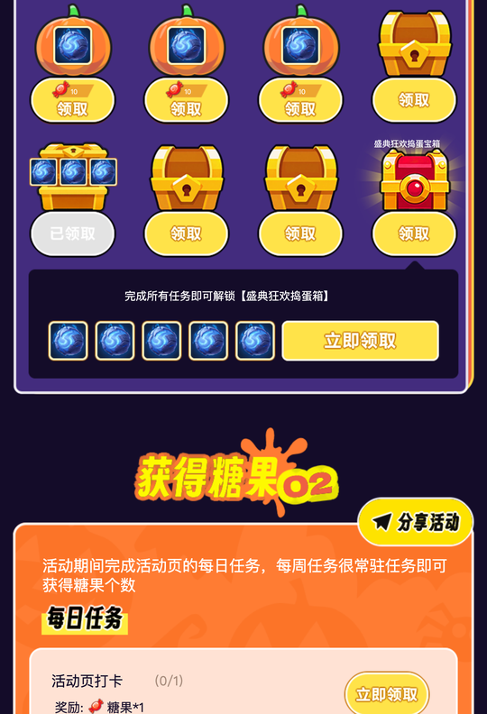
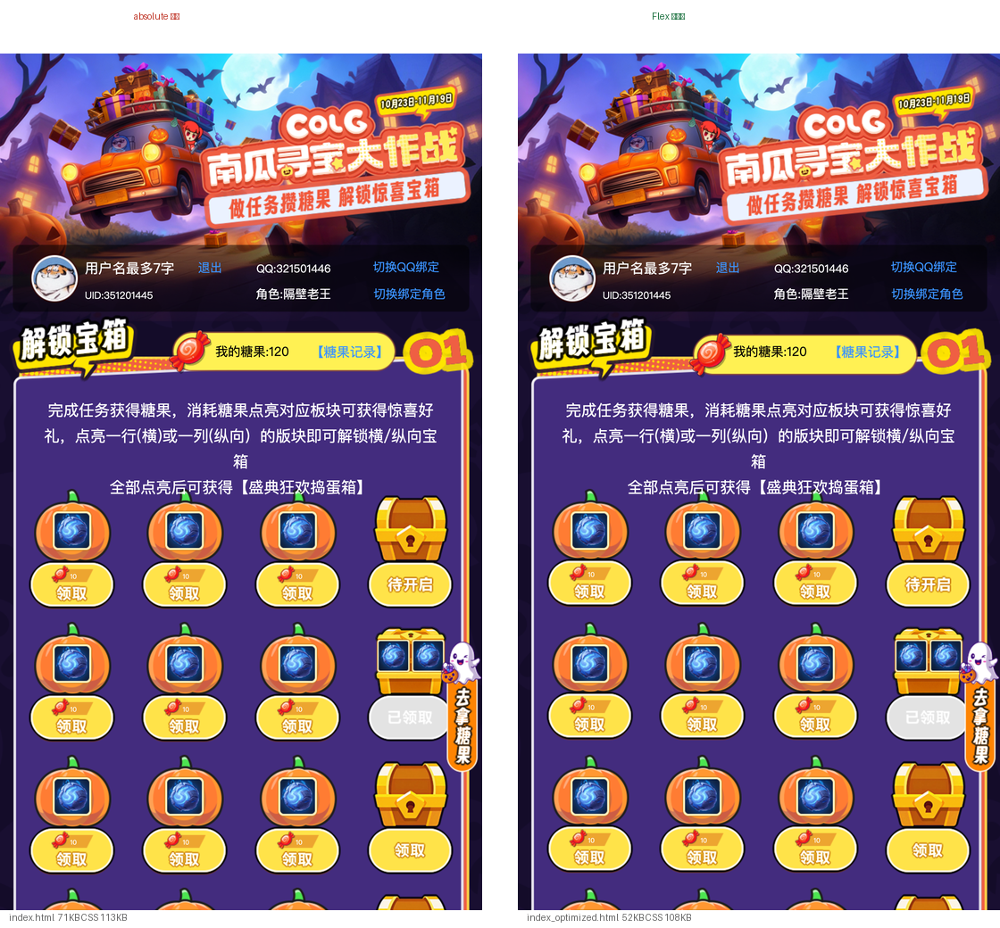
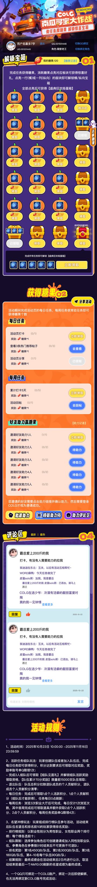

> 🌐 **Language / 语言**：**简体中文** | [English](./README_EN.md)

---

## 一、为什么不用现成的 PSD 转 HTML 工具？

市面上其实已经有不少 PSD 转代码方案，但落到运营活动 / H5 / 长图详情页这类「**像素级还原**」需求上，普遍有三个痛点：

| 痛点 | 现象 |
|------|------|
| ① 文字字号不准 | PSD 里的 `FontSize=17.5`，浏览器渲染出来又小又模糊——因为忽略了图层 `transform.scale` |
| ② 全是 `position: absolute` | 几百个图层全部绝对定位，CSS 体积爆炸，后期完全不可维护 |
| ③ 组级效果丢失 | 圆角矩形 8px 外描边、文字描边+投影叠加，要么裁切要么糊掉 |

我们做了一组对比统计（实际 PSD：南瓜大作战 H5、总决赛-折叠 H5、兑奖 H5）：

```
传统切图工作流：     设计稿到可运行 HTML 平均  4~6 小时
psd2code 自动转换： 设计稿到可运行 HTML 平均  20 秒
```

由此得出 `psd2code` 的四大核心方向，也正是本文后续四大章节：

- **PSD 解析**：借助 `psd-tools`，但对它的缺陷做深度修补；
- **资源提取与优化**：像素去重 + 智能命名 + 合成背景图；
- **布局优化**：聚类算法识别行列/网格、智能重写成 Flex；
- **多 Target 可插拔**：同一份 IR，一键产出 HTML / React / Vue 三种工程。

---

## 二、整体架构：编译器式分层

`psd2code` 借鉴编译器的「**前端解析 + IR + 后端代码生成**」三段式：



**核心抽象**：

1. **IR (Intermediate Representation)**：pydantic BaseModel 严格定义、自带校验。是 `core` 与 `targets` 之间的契约——任何 target 都从 IR 出发，**不直接读 PSD**。
2. **PipelineContext**：贯穿所有 Stage 的全局上下文，承载 PSD、IR、配置、产物路径、target 中间产物等。
3. **Stage**：单一职责的处理步骤，输入/输出都是 PipelineContext。
4. **Target**：一个产物对应一个 Target 子类，通过 `@register("html")` 注册到全局 registry。

这个分层带来一个直接好处：**HTML target 每次能力升级，自动惠及 React / Vue target**——因为后两者只是在 HTML 产物之上做二次加工。

---

## 三、Skill 使用方式

`psd2code` 同时也是一个 **CodeBuddy Skill**，对话里直接说"帮我把这个 PSD 转成 HTML"就会自动触发；也可以脱离 CodeBuddy 单独跑命令行。

### 3.1 在 CodeBuddy 中调用（推荐）

只要项目里有 `.codebuddy/skills/psd2code/` 目录，触发词就能让 CodeBuddy 自动加载该 skill：

> "帮我把 `设计稿/南瓜大作战.psd` 转成 HTML"
> "把这个 psd 转成 React 项目"
> "psd 转 vue"
> "设计稿转代码"

CodeBuddy 会自动选择合适的 target、定位 PSD 文件、执行 skill、把产物路径回报给你。

### 3.2 命令行直接运行

```bash
# 默认 target = html（同时产出 absolute 原版 + Flex 优化版）
python3 .codebuddy/skills/psd2code/psd_to_code.py /path/to/file.psd

# 显式指定 target
python3 .codebuddy/skills/psd2code/psd_to_code.py /path/to/file.psd --target html
python3 .codebuddy/skills/psd2code/psd_to_code.py /path/to/file.psd --target react
python3 .codebuddy/skills/psd2code/psd_to_code.py /path/to/file.psd --target vue
```

### 3.3 常用参数

| 参数 | 默认 | 说明 |
|------|------|------|
| `--target {html,react,vue}` | `html` | 选择产物形态 |
| `--css-style {compact,expanded}` | `compact` | 优化版 CSS 输出风格：`compact` 接近手写、`expanded` 全展开 + PSD 坐标溯源注释 |
| `--no-css-pretty` | 关闭 | 关闭 CSS 美化，回到字母序机械渲染（CI 基线对比常用） |
| `--no-smart-merge` | 关闭 | 关闭 LayoutOptimizer 链路的「多 url 背景内联合成」（DOMRestructure 内联 + `background_flatten` 文本兜底）。这两项合图只是把同一容器的多 url 背景合成单图、**不删除任何 DOM 子节点**，副作用小，因此默认开启；加该参数后每条 `background-image: url(a), url(b), ...` 保持原样，便于 1:1 逐层诊断 |
| `--enable-image-layer-flatten` | 关闭 | 显式启用 LayoutOptimizer Step 1.2 `ImageLayerFlatten`：把容器内 N 个 image 子合成单张 PNG 并**删除所有子 DOM 节点**。**默认关闭**（2026-05-27 起），因为它会把语义独立的栅格化元素（按钮 / 数字框 / 被栅格化的 TypeLayer）和真正的装饰像素一起合并，丧失 DOM 可访问性。仅在确认整组是纯装饰时启用 |

举例：

```bash
# 想要排查某个元素位置不对，开 expanded 模式看坐标溯源注释
python3 .codebuddy/skills/psd2code/psd_to_code.py 南瓜大作战.psd --css-style expanded

# 跑 React 产物 + 启动 dev server
python3 .codebuddy/skills/psd2code/psd_to_code.py 南瓜大作战.psd --target react
cd output/南瓜大作战/react
npm install && npm run dev    # http://localhost:5173

# 跑 Vue 产物
python3 .codebuddy/skills/psd2code/psd_to_code.py 南瓜大作战.psd --target vue
cd output/南瓜大作战/vue
npm install && npm run dev    # http://localhost:5173

# 关闭多 url 背景内联合成，保持原始多 url CSS（1:1 诊断用）
python3 .codebuddy/skills/psd2code/psd_to_code.py 南瓜大作战.psd --no-smart-merge

# 显式启用 ImageLayerFlatten（默认关闭，2026-05-27 起）
python3 .codebuddy/skills/psd2code/psd_to_code.py 南瓜大作战.psd --enable-image-layer-flatten
```

> **`--no-smart-merge` 到底关了什么？** 仅 LayoutOptimizer 链路的两项「多 url 背景合成」：
> 1. **DOMRestructure 多 url 背景内联合成**——容器内多张装饰背景层默认会被 `compose_layers` 合成一张 `flat-*.png` 写到容器的 `background-image`。
> 2. **`background_flatten` 文本兜底**——主路径漏掉的多 url 背景在最后通过 CSS 文本扫描再合成一次。
>
> 这两项**不删除任何 DOM 子节点**、不影响 DOM 结构，副作用很小，因此默认开启；只有想 1:1 对照 PSD 图层树或跑像素级回归基线时再关掉。
>
> **解析阶段 (`LayerExporter`) 已不再做任何"装饰性合图"**——1 PSD 图层 = 1 layer_info / 1 PNG，`--no-smart-merge` 对解析阶段没有任何影响。
>
> **`ImageLayerFlatten` 默认关闭**（2026-05-27 起）：它会把容器内 N 个 image 子合成单张 PNG **并删除全部子 DOM**，过于粗暴——典型反例：抽奖活动「游泳圈」组里 `游泳圈底图 + 数字框矩形 + 礼盒文字`（3 个语义独立元素）会被合并成单张 `flat-*.png`，无法独立改色 / 换文案 / 绑事件。需要时通过 `--enable-image-layer-flatten` 显式启用。
>
> **新旧两条入口**（`psd_to_code.py` CLI / `PSDToHTMLConverter(psd_path, smart_merge=False, image_layer_flatten_enabled=True)` Python API）都支持上述开关。

### 3.4 产物目录速查

```
output/<psd_stem>/
├── html/                        # 任何 target 都会先产出
│   ├── index.html               # 原始 absolute 版（保留 dev metadata，方便诊断）
│   ├── index_optimized.html     # Flex 优化版（已剥离 dev metadata，最终交付物）
│   ├── style.css / style_optimized.css
│   ├── main.js                  # 国际化等运行时逻辑
│   ├── metadata.json            # 图层树元数据
│   ├── layer_map.json           # 反查表：CSS 类名 → PSD 原图层名
│   ├── _naming_report.md        # 语义命名报告（每个 token 的来源）
│   └── images/                  # 切图 / 合成图 / 背景图
├── react/                       # --target react 时产出
└── vue/                         # --target vue 时产出
```

### 3.5 排查与定位三件套

跑完后如果发现某处不对，**优先看这三个文件**：

- **`_naming_report.md`**：CSS 类名为什么是这个？哪一层（layer1 词典 / layer2 角色推断 / fallback 拼音）给的？
- **`layer_map.json`**：`.bg-main-4e8c1d` 是 PSD 里的哪个图层？图层类型？
- **对比 `index.html` 和 `index_optimized.html`**：absolute 原版作为"地面真相"，优化版有偏移基本就是 LayoutOptimizer 哪一步过激了。

### 3.6 系统依赖

```
Python 3.10+
psd-tools >= 1.17.1
Pillow >= 10
numpy
beautifulsoup4
pydantic >= 2.0
pypinyin
```

---

## 四、PSD 解析：踩过 psd-tools 的那些坑

`psd-tools` 是 Python 生态里最成熟的 PSD 解析库，但**它只实现了最常用的渲染器**，对一些常见场景（shape 填充 + 图层样式、超大发光溢出、引擎字典 transform 等）要么出错、要么丢失。我们的做法是：**能修的源码级修，不能修的绕开走手动栅格化**。

### 3.1 文字 `transform.scale` 修正

PSD 文本图层的 `engine_dict.StyleRun...FontSize` 是**原始字号**，但 PS 实际渲染时会用 `layer.transform = (a, b, c, d, e, f)` 矩阵缩放——其中 `a` 是 X 缩放、`d` 是 Y 缩放。



真实例子：

```
PSD 图层："消耗99兑换币"
  raw FontSize    = 17.5
  transform.scale = 1.6
  实际渲染字号     = 17.5 × 1.6 ≈ 28px
```

如果忽略 `transform.scale`，浏览器会用 17.5px 渲染，文字直接缩成花生米。另一个易踩的兄弟坑：`ParagraphSheet` 的路径不在 `StyleRun` 下，而是 `engine.ParagraphRun.RunArray[0].ParagraphSheet.Properties` 里的 `Justification`，老代码写错路径会导致**所有文字永远左对齐**。这两处我们在 `core/psd/text_extractor.py` 里重新解析。

### 3.2 浏览器字宽差异：纵向 + 横向双兜底

PSD 设计师常用思源黑体 / 造字工房，浏览器渲染时却用 PingFang / Arial——**相同字号下，浏览器中文会比 PSD 更宽**，导致：

- 单行文本被挤成两行（"预测四"+"强"）
- 按钮内文字撑出按钮边界



我们设计了双兜底：

```python
# 纵向兜底：字号不超过 bbox 高度的 0.85
if font_size >= height * 0.85:
    font_size = height * 0.85

# 横向兜底（仅纯中文短标题）：按字数 + 宽度倒推上限
if pure_cjk and char_count <= 12:
    max_font_by_width = width / cjk_count * 0.95
    font_size = min(font_size, max_font_by_width)
```

效果验证（总决赛-折叠 PSD）：

| 文本 | 修正前 | 修正后 | 效果 |
|------|--------|--------|------|
| 主赛区（68px 宽） | 25.5px | **20.9px** | ✓ 单行 |
| 预测四强（164px 宽） | 46.75px | **38.5px** | ✓ 不再折行 |

### 3.3 Shape + 图层样式描边：psd-tools 的致命 bug

一个看似普通的 PSD shape 图层（`#feffd7` 浅黄填充 + 2px 内描边 `#5f8618` 绿色），**用 `psd-tools` 直接 `layer.composite()` 会得到整片纯绿色**——填充色完全丢失。

排查后发现两个叠加的根因：

1. `layer.topil()` 对 shape 返回 `None`，老代码降级到 `layer.composite()` 取基础图；但 `composite()` 把整块 shape 区域错误地涂成描边色。
2. `draw_stroke_effect` 用 `skimage.filters.scharr` 检测 alpha 边缘做描边，**当 alpha 紧贴画布无 padding 时，scharr 检测不到边缘**，归一化后 mask 整片=1，描边色铺满整张图。

**绕开方案**：

- 新增 `_render_shape_base_from_fill(layer)`：跳过 `composite()`，直接读 `SoCo` 填充色 + `origination` 几何（Rectangle / RoundedRectangle / Ellipse）用 PIL `ImageDraw` 合成基础图。
- 调用 `draw_stroke_effect` 前给 alpha 加 padding（`pad = max(stroke_size+2, 4)`），渲染完再裁回。

```python
# stroke_renderer.py
padded_alpha = np.pad(alpha, ((pad,pad),(pad,pad),(0,0)), mode='constant')
stroke_color, stroke_mask = draw_stroke_effect(bbox, padded_alpha, ...)
out[:,:,:3]  = stroke_color[pad:pad+h, pad:pad+w, :]
out[:,:,3:4] = stroke_mask[pad:pad+h, pad:pad+w, :] * opacity
```

效果：兑奖活动卡片的浅黄背景 + 2px 绿描边正确还原，无需人工补图。

### 3.4 图层样式的两层 enabled 开关

PS 图层样式面板有两个开关：

- **整体开关**：`layer.effects.enabled`（fx 行最左边那个勾）
- **单项开关**：`effect.enabled`（外发光/描边/投影各自的勾）

**PS 的规则**：整体开关关闭 → 所有效果都不渲染，**哪怕单项 enabled=True**。

`psd-tools` 不替你 AND 这两个标志，psd2code 早期代码多处只看 `effect.enabled`，导致"PS 中没效果的文本"被当成"有外发光"处理，错误地栅格化成图片。修复后统一用一个 helper：

```python
def is_effect_active(effect, layer):
    if not layer.effects or not layer.effects.enabled:
        return False
    return bool(effect.enabled)
```

全工程 8 处调用点全部切换。这解决了带 fx 残留的昵称文本全部被错误降级为图片的问题。

### 3.5 组级效果溢出：手动渲染 + composite 混合

PS 图层效果（描边、阴影、发光，共 8 种）在组（Group）级别有个隐蔽特性：**效果会沿组的整体边界裁切**。

`psd-tools` 的 `composite()` 能在组内正确复现这一行为——但**只在组的 bbox 内有效**。一个圆角矩形有 8px 外描边时，描边会溢出组的 bbox 被 `composite()` 裁掉。实测过各种"绕过"方法——父级 composite、根级 composite、给超大 viewport——都是徒劳：

> psd-tools 在任何层级 composite，都按目标节点（及其所有祖先组）的 bbox 做硬裁切，**不存在绕过方案**。

我们的解法是「**手动栅格化 + composite 混合**」：



```
1. 先用扩展画布 + 手动逐层渲染 → 拿到完整溢出像素（外部区域）
2. 再用 group.composite(viewport=bbox) → 拿到组 bbox 内的 PS 原生高质量
3. 把 composite 结果覆盖到手动渲染结果的内部区域
```

最终：**外部保留溢出效果，内部达到像素级匹配**（实测 Alpha 差异 max=0、mean=0.00）。

> **硬约束**：子组（嵌套组）必须用 `sub_grp.composite(viewport=grp_bbox)` 渲染，不能退回"递归调用 `_render_group_expanded` + 裁切"——历史回归实测会在圆角轮廓位置多出 ~75px/行的错误描边。

### 3.6 总结：PSD 解析的修复清单

| 问题 | 表现 | 我们的做法 |
|------|------|-----------|
| transform.scale 未应用 | 文本被缩成花生米 | 读 `layer.transform[0]`，FontSize 乘以它 |
| ParagraphSheet 路径错误 | 所有文字都是左对齐 | 走 `ParagraphRun.RunArray[0]` 路径重新解析 |
| shape + 图层样式整片涂描边色 | 兑奖卡片全变绿 | 手动栅格化填充 + 给 alpha 加 padding 再描边 |
| 两层 enabled 未 AND | 无效果文本被错误降级为图片 | 统一 `is_effect_active(effect, layer)` |
| 组级效果溢出被裁 | 外描边断掉 | 混合渲染：手动扩展 + composite 覆盖 |

---

## 五、资源提取与优化

`psd2code` 对每个图层做一次决策：**切图 / 文字保留 / shape 用 CSS 还原 / 吸收为父容器背景 / 合并成单图**，最终写到 `output/<psd>/html/images/` 目录。

### 5.1 智能去重：基于内容哈希而非图层名

活动页里"星星""糖果""装饰点"这类小图会被设计师复用几十次，每次都单独切图是极大浪费。

```python
def _save_image_dedup(self, img, name, depth) -> str:
    data = serialize(img)                        # 按 Config.IMAGE_FORMAT 序列化
    md5_hash = hashlib.md5(data).hexdigest()
    if md5_hash in self._image_hash_map:         # 命中去重
        return self._image_hash_map[md5_hash]
    path = make_image_filename(name, content_hash=md5_hash, ltype=ltype)
    self._image_hash_map[md5_hash] = path
    write(path, data)
    return path
```

南瓜大作战 H5 实测：239 个 image 图层 → 87 张 PNG（去重率 63.6%）。

### 5.2 语义化文件名：tag + 内容哈希

旧方案拼音 + 自增序号（`yuanjiaojuxing_3_7.png`）有两个问题：HTML 里不可读；每次运行序号都在跳，git diff 噪声极大。

新方案：

```
images/<semantic-tag>-<md5前6位>.png

例：rounded-a3f012.png
    btn-receive-279914.png
    bg-main-4e8c1d.png
    candy-big-7b0a12.png
```

- `semantic-tag` 由 `semantic/` 子包从图层名推断得出（支持 3 层置信度：Layer2 角色推断 → Layer1 清洗词典 → fallback 关键词 + 拼音），PS 默认名走 `ltype` 兜底（`img`/`shape`）
- `md5前6位` = 图片内容哈希——**PSD 没改，文件名就不变**，git diff 和 CDN 缓存两全其美
- 同名撞车自动追加 `-2/-3`

### 5.3 形状层保留矢量：不切图就是最好的优化

圆角矩形、椭圆、纯色矩形这类简单 shape，不切图而是**直接翻译成 CSS 几何属性**：

| PSD shape | 输出 CSS |
|-----------|---------|
| Rectangle + SoCo 填充 | `background: <color>; width/height` |
| RoundedRectangle | `border-radius: <r>px` |
| Ellipse | `border-radius: 50%` |
| shape + 图层样式描边 | `border: <w>px solid <color>` |

效果：CSS 体积下降的同时，文件也能 retina 无损缩放。

### 5.4 多张全屏背景的合成

活动页常见模式：**组里有 2~3 张全屏背景叠加**（渐变底 + 花纹 + 噪点）。如果每张都单独切图，HTML 里会写多 url 背景：

```css
.bg-section {
  background-image: url(bg-gradient.png), url(bg-pattern.png), url(bg-noise.png);
  background-position: 0 0, 0 0, 0 0;
  background-repeat: no-repeat, no-repeat, no-repeat;
}
```

问题：多张 PNG 多次请求，而且浏览器要多次合成。psd2code 的做法是**在布局优化阶段检测这种多 url 模式，用 PIL alpha_composite 合成单张 PNG 写回磁盘**：

```
输入：bg-gradient.png(284 KB) + bg-pattern.png(412 KB) + bg-noise.png(67 KB)
输出：flat-af0dce35.png (153 KB)   # 1/5 体积、1 次请求
```

南瓜大作战 H5 实测：47 组合并、节省 45.6 KB。

一个与 CSS 规范相反的坑：**`background-image: url(a), url(b)` 中第一个 url 在视觉最上层**，而 PIL `alpha_composite` 期望"底层在前"。调用方必须 reverse 列表——早期代码漏掉 reverse 导致所有合成图的颜色上下层叠错，颜色"对调"。

### 5.5 图层扁平化：子图合并 + 父容器吸收（默认关闭）

> **⚠️ 2026-05-27 起 `ImageLayerFlatten` 默认关闭**（`FlattenConfig.enabled = False`）。下面描述的优化逻辑仍然存在于代码中，需要时通过 CLI `--enable-image-layer-flatten` 或 `PSDToHTMLConverter(..., image_layer_flatten_enabled=True)` 显式启用。
>
> **关闭原因**：判定虽然检查了 `data-type=image / 单 PNG / 邻接连通` 等几何条件，但**无法识别"栅格化产物背后的语义角色"**。典型反例：抽奖活动「游泳圈」组里 `游泳圈底图(pixel) + 数字框矩形(shape) + 礼盒文字(被栅格化的 TypeLayer)` 这 3 个语义独立元素会被合并成单张 `flat-*.png`，丧失独立改色 / 换文案 / 绑事件的能力。在无法可靠识别"纯装饰组"之前，默认关闭比较安全。

更激进的优化：当一个容器里**只有纯 image 子图层**（无文本、无按钮），把容器自身的 background + 所有 image 子按 z 序合成单张 PNG、删掉所有子 div 及其 CSS 规则、只留容器自己的 `background-image`。

这个 `ImageLayerFlatten` transformer 采用**后序遍历 + 多轮扫描**：最深层先合并、外层再发现"我的子变成单 div 了"继续合并。护栏非常严格：

- 子元素必须全部 `data-type="image"` 且无孙子
- `opacity≈1` / `mix-blend-mode: normal`
- 容器本身不能有 `border-radius / box-shadow / clip-path / filter / transform` 等"不能烧进 PNG 的装饰字段"（一旦合并后再叠这些，会双重作用）
- 总层数 ≥ 2，几何包围盒 ≤ 画布 50%（否则合并一张巨图反而得不偿失）

南瓜大作战 H5 实测：这一步搞定了 47 个容器的视觉简化，DOM 节点从 ~500 降到 ~280。

---

## 六、布局优化（本工具最核心的功能）

直接用 absolute 还原 PSD 没问题，但 200+ 图层全部 `position: absolute` 是工程灾难。`psd2code` 的 **LayoutOptimizer** 把 absolute 智能重写成 Flex，同时保证视觉零偏移。



### 6.1 七步流水线全景



### 6.2 聚类算法：怎么"看懂"一堆 absolute 框

这是整个 LayoutOptimizer 的灵魂。对任意一个容器，我们有 N 个子图层的 bbox（left/top/width/height），目标是自动把它们组织成**行（row）/ 列（col）/ 叠图组（stack）**的树状结构。

**第一步：切行（`_split_by_rows`）**

从左到右、从上到下遍历子元素，维护一个"当前行"的 envelope（bbox 包络）。新来一个元素 e，判断它和 envelope 的**纵向重叠率**：

```
overlap_y = min(e.bottom, env.bottom) - max(e.top, env.top)
ratio     = overlap_y / min(e.height, env.height)

if ratio >= 0.5:  # 同行判据
    env 吸收 e，继续
else:
    新开一行
```

**第二步：行内切列**

对每一行内部，把切行逻辑换成纵/横轴就是切列。递归后我们得到一棵"行包列 / 列包行"的嵌套树。

**第三步：背景层剥离**

一个组里常有"全屏卡片底框 + 多个浮层元素"的设计模式。直接聚类会把底框当成一个"占 100% 空间的大元素"，严重干扰行/列判断。我们在聚类前先剥离满足以下三种规则之一的"背景层"：

- **完全包含型**：bbox 完全包住其他所有元素
- **主轴覆盖型**：在主轴（宽或高）上覆盖 ≥ 90%
- **双轴主导覆盖型**：宽、高都覆盖 envelope ≥ 80%（识别"略带 padding 的卡片底图"）

剥离后的背景层被吸收进父容器的 `background-image` 列表。

**第四步：伪多行装饰堆叠回退**

切出多行后，若所有行都只有一个元素、且相邻行横向覆盖率 ≥ 80%，回退为 stack（堆叠）——这是"图标 + 标题上下贴边"这种"本质上堆叠装饰"的场景。

**第五步：二维网格识别**

当多行 × 多列的元素满足"列对齐 + 跨行对齐"时，单纯用"列 包 行"嵌套表达不够干净，改成显式的 **`v-grid-row` + flex column** 结构：

```
rows = _split_into_rows(...)
if len(rows) >= 2 and all_rows_have_aligned_cols(rows):
    layout_type = 'grid'
    flex_applier 包装为：
      父: display:flex; flex-direction:column
      每行: <div class="grid-row-N v-grid-row">
```

南瓜大作战 H5 的"用户信息区"9 个子图层（剥掉背景卡 + 头像装饰后剩 7 个文本），被正确识别为 2 行 × [4, 3] 列 grid。

### 6.3 三道安全闸门：什么时候**不该**用 Flex

不是所有看起来"整齐"的容器都该用 Flex。我们踩过太多坑后总结出三道闸门（全在 `layout_analyzer.py`）：

**互相重叠的装饰簇**

n 个图层互相重叠（每个与多个邻居都重叠），且 `trend_ratio < 0.6`。典型场景：多层装饰贴纸、若干徽章叠在一起。判定为堆叠装饰，保持 absolute。

**支配背景层**

存在某个子元素 X 满足 `X.area / envelope.area >= 0.8`，且其余子元素中 ≥ 60% 显著落在 X 内（重叠/自身面积 ≥ 0.6）。判定为"大底图 + 多个浮层"的卡片，整组保持 absolute。

**装饰剥离**

先把子节点分类为 **bg / decor / content** 三类，**只在 content 子集**上做趋势检测。这让"内容整齐成行 + 角落有装饰"的容器不再因为装饰打乱排版被误判。

### 6.4 Flex 应用：非趋势子元素保留 absolute

识别为 vertical / horizontal 后，我们把**趋势元素**写成 flex 子项（用 margin 表达间距），**非趋势元素**（角标、装饰）保留其 `position: absolute` 坐标：

```css
/* 趋势元素：flex 流 */
.prop-card-1 { margin-top: 20px; margin-left: 0; }
.prop-card-2 { margin-top: 18px; }

/* 非趋势元素：保留 absolute */
.badge { position: absolute; right: -6px; top: -6px; }
```

这里有个**极易反复重犯的 bug**：容器重构后，子元素的 `top/left` 是"相对父容器"的坐标（由 extract 阶段产出），不需要再减父 top。

还有一条来自 v-stack 的保护：flex_applier 默认会 `del child_css['position']` 把子元素的定位去掉；但如果子本身是 v-stack wrapper（内含 absolute 子节点），删除 position 会让其孩子跳到外层定位，直接飘到屏幕角落。修复：遇到 `'v-stack' in child.classes` 就改成 `position: relative`，而不是删除。

### 6.5 同质兄弟簇检测：识别"同类卡片"

PSD 设计师经常把 N 个商品卡 / 道具卡 / 礼包卡**平铺在 #canvas 直接子，没有用父组包起来**。传统聚类只在已有 group 内部做，这种列表会全部走 absolute 路径，开发拿到的 HTML 完全看不出"它是一个数据列表"，没法直接写 `v-for`。

`SiblingGroupDetector` 的 5 条 AND 规则：

1. ≥ 3 个连续兄弟
2. **class 词根相同**（去掉 `__\d+` 后缀和 `-\d+` 序号）——`prop__30 / prop-2__38 / prop-10__101` 词根都是 `prop`，**这是最强的设计师意图信号**
3. bbox 尺寸近似（误差 ≤ 5%）
4. 满足网格规则：`M 列 × K 行` 满格排布，同列 left 一致、同行 top 一致（误差 ≤ 2px）
5. 父容器本身不是 flex

识别成功后包成虚拟容器：

```html
<div class="prop-list v-list" data-virtual="list">
  <div class="prop__30 layer-group">...</div>
  <div class="prop-2__38 layer-group">...</div>
  <div class="prop-3__45 layer-group">...</div>
</div>
```

CSS 用 `display: flex; flex-wrap: wrap; column-gap / row-gap`，下游开发可直接写 `v-for`。

> **一个设计决定**：我们**不做子结构同构判定**。实际 PSD 里同类卡几乎总是有差异（首张卡设计完复制改文案，结构漂移：少一行文字、按钮换成图片、装饰数量不一致）。强求子结构一致会**绝大多数现实场景识别失败**——class 词根 + bbox 尺寸两条已经够强。

### 6.6 CSS 去冗余：z-index 精简 + 等价规则合并

`core/extract/layer_exporter.py` 给每个图层无脑塞 `z-index = 全局 layer_id`——这是合理的像素还原默认值，但优化版完全不需要。`CssDedup` 分两个 Pass：

**Pass 1 — z-index 精简**

遍历每个父容器，收集子元素的 `(selector, z)` 序列：

| 形态 | 动作 |
|------|-----|
| 长度 0 | 跳过 |
| 长度 1（独 z，其他全 None） | 删该 z-index |
| 长度 ≥ 2 严格递增 | 全删（DOM 顺序 = z 序） |
| 长度 ≥ 2 出现倒挂 | 全保留 |

逻辑：`position:absolute` 子元素的叠序只在"兄弟 bbox 重叠"时依赖 z-index；绝大多数父容器下"DOM 顺序 = z 序升序"（这是 LayerRenderer 的天然产出），浏览器默认行为就能正确实现叠序。

**Pass 2 — 等价规则合并**

属性 dict 完全相等的多个选择器合并为 `.a, .b, .c { ... }` 单条规则。南瓜大作战 H5 实测合并 209 条。

**Pass 3.5 — 重复元素抽取**

Pass 2 合并了 CSS，**但 HTML 里依然写了 N 个不同的 hash 类**（`.prop__68 / .prop__105 / ...`）。`RepeatClassUnifier` 进一步：≥ 3 个 `.<base>__<digits>` 形式的等价类 → 合并为单一 base 类（`.prop`），HTML 同步改写。

最终 HTML 里你看到的就是：

```html
<div class="prop-list v-list">
  <div class="prop layer-group">...</div>
  <div class="prop layer-group">...</div>
  <div class="prop layer-group">...</div>
</div>
```

直接就是这种干净的语义化结构。

### 6.7 实战效果（南瓜大作战 H5）

| 指标 | V2 优化器 | 当前版本 |
|------|-----------|---------|
| 元素位置偏移 PSD 原位置 | 94 个元素偏离 5~13px | **0 个元素偏离** |
| CSS 行数 | 4805 | **1499** |
| CSS 块数 | 457 | ~270 |
| z-index 字段 | 432 | 97 |
| 6×4 任务网格识别 | 每个 cell 独立 absolute | 自动识别 v-col + v-row 嵌套 |

下面这张是真实产物里"任务格子"那段——20 多个图层、4 行多列、每个 cell 带描边小图标，全部由算法自动识别：



### 6.8 算法的天花板与人工边界

再好的算法也有上限——下面这些场景 psd2code 会"尽力而为，但结果不一定最优"：

**① Flex 布局化不充分：设计师图层组织混乱**

典型问题：活动页版块 2 的按钮、图标、装饰全部散乱摆在同一个 PSD 根组，没有任何分组——**聚类算法能看到的只是 bbox 位置，看不到"设计意图"**。

👉 **解决方案：整理 PSD 图层结构**。按视觉版块分组（`版块1-签到 / 版块2-道具 / 版块3-任务`），每个版块内部再按"标题 / 卡片列表 / 底部按钮"分组。psd2code 会优先在**已有组内部**做聚类，组边界 = 聚类边界。分好组之后，95% 的场景都能自动重构为干净的 Flex。

**② CSS 不够语义化：图层名用了默认命名**

典型问题：PSD 图层名是 `矢量智能对象`、`图层 12 拷贝 3`、`形状 47`——psd2code 只能给你 `.img-a3f012` 这种内容哈希名，无从推断语义。

👉 **解决方案：整理图层命名**。重要的结构性图层给中文或 kebab-case 命名（`bg-main` / `btn-领取` / `用户信息背景` / `任务卡片`）。psd2code 的 `semantic/` 子包能识别：
- 按钮语义：`btn` / `按钮` / `领取` / `确定` → `.btn-receive` / `.btn-ok`
- 背景语义：`bg` / `背景` / `底框` → `.bg-main`
- 卡片容器：`prop` / `card` / `道具` → `.prop-card`
- 中文关键词：通过 `common/cn_dict.json` 词典映射到 kebab-token

命名整洁之后，HTML 就会是 `.prop-card / .btn-receive / .user-info-bg` 这种一眼看懂的语义类，而不是 hash 串。

**③ 人工干预：特殊场景需人工调整**

`psd2code` 只实现常用渲染器所以部分图层导出效果不好（全实现产出比太低），需要人工干预。

👉 **解决方案：手动栅格化或导出图片**。

---

## 七、实战演练：把"南瓜大作战 H5"PSD 跑一遍

以 **南瓜大作战 H5**（750 × 6778 长图活动页）为例，**一行命令** 20 秒拿到完整可运行 HTML：

```bash
$ python3 psd_to_code.py "南瓜大作战 H5.psd" --target html

🎨 合并背景图层: ['背景', '矩形 1', '形状 839 拷贝 2']
🖼️  background [合并3层 750x6778] → images/background-f07984.png
📁 solgan (组)
  ✨ 形状 16 (含效果渲染)
  🌟 检测到效果溢出 6px，使用混合渲染策略
📁 版块1 (组) ...
🎨 开始布局优化...
✅ 优化完成！
   - DOM 重构: 60 个
   - v-list 创建: 3 个 (包裹 24 个节点)
   - 应用 flex: 28 个
   - z-index 精简: 304 处
   - CSS 等价规则合并: 节省 128 条
   - 重复元素抽取: 25 组 → 删除 49 个 hash 类、复用到 61 个元素
✅ 产物：output/南瓜大作战 H5/html/
```

> 上面的日志摘自 2026-04 基线。**2026-05-27 起 `ImageLayerFlatten` 默认关闭**，所以现在跑同一 PSD 不会再有"图层扁平化: 47 个容器"那行；如想看历史效果，加 `--enable-image-layer-flatten` 即可复现。

**浏览器打开 `index.html` 第一屏**——和 PSD 设计稿完全像素对齐，包括 solgan 上的描边发光、用户信息区的圆角、糖果图标的渐变叠加：

<p align="center">

</p>

**absolute 原版 vs Flex 优化版对比**：



| 文件 | HTML 大小 | CSS 大小 | 定位方式 | 可维护性 |
|------|-----------|----------|----------|----------|
| `index.html` | 71 KB | 113 KB | 全部 `position: absolute` | ⭐⭐ |
| `index_optimized.html` | 52 KB | **38 KB** | Flex 嵌套 + 局部 absolute | ⭐⭐⭐⭐ |

> 不要小看这 75 KB 的 CSS 压缩——它代表着 60 个容器被语义化、25 组 hash 类被复用，后期改样式不再需要逐个调 `top/left`。

**整个活动页 6778px 长**，包含 9 大版块（用户信息 / 任务区 / 道具 / 助力 / 排行 等）：

<p align="center">

</p>

转换日志里有几个有意思的点：

- **组级效果溢出自动触发 3 次**：solgan 日期组（6px）、副标题组（10px）、糖果数目组（4px）——全部走"手动栅格化 + composite 混合"。
- **3 组同质兄弟列表识别**：道具卡 × 6、任务卡 × 12、排行榜条目 × 6，被包成 `v-list`——可直接写 `v-for`。
- **叠图组识别**：邀请助力 / 核销助力码 / 版块3（7 个图层）等被 V8/V9 闸门正确识别为"装饰堆叠"，保持 absolute。

---

## 八、多 Target 可插拔架构

### 8.1 Target Registry：装饰器注册

`targets/registry.py` 非常简单：

```python
_REGISTRY: dict[str, Type[Target]] = {}

def register(name: str):
    def _wrap(cls: Type[Target]) -> Type[Target]:
        key = name.strip().lower()
        if key in _REGISTRY and _REGISTRY[key] is not cls:
            raise ValueError(f"Target '{key}' already registered")
        cls.name = key
        _REGISTRY[key] = cls
        return cls
    return _wrap
```

每个 target 是 `Target` 子类，实现 `build_pipeline(ctx) -> Pipeline`：

```python
# targets/html/target.py
@register("html")
class HtmlTarget(Target):
    def build_pipeline(self, ctx):
        return Pipeline([
            LoadPsdStage(),
            ParseStage(),
            ExtractAssetsStage(),
            CodegenStage(),
            LayoutOptimizeStage(),
            EmitStage(),
        ])

# targets/react/target.py
@register("react")
class ReactTarget(Target):
    def build_pipeline(self, ctx):
        return Pipeline([
            HtmlTarget().build_pipeline(ctx),   # 先产出 HTML（含优化版）
            Html2ReactStage(),                  # 再转 JSX + Vite 脚手架
        ])

# targets/vue/target.py 同理
```

CLI `--target vue` → `get("vue")` → 实例化 → `target.run(ctx)`。新增 target（比如小程序）只需：

```python
@register("mini-program")
class MiniProgramTarget(Target):
    def build_pipeline(self, ctx):
        return Pipeline([
            HtmlTarget().build_pipeline(ctx),
            Html2WxmlStage(),        # 转 WXML
            Html2WxssStage(),        # 转 WXSS
        ])
```

无需改动核心代码。

### 8.2 为什么 React / Vue 都在 HTML 基础上二次加工

业界也有"直接从 IR 生成 JSX"的设计，但 psd2code 选择"先走一遍 HTML target，再转框架"：

- **HTML target 的优化（布局、CSS 去冗余、语义化命名）免费继承给 React/Vue**——任何一次 LayoutOptimizer 升级自动惠及三端。
- 开发者本地 review 时可以直接对比 `html/index_optimized.html` 和 `react/src/App.jsx` 的视觉一致性，容易定位转换问题。
- React/Vue 的转换就是 DOM 遍历 + class/style 重映射 + 模板语法替换，逻辑简单、可测试性强。

### 8.3 产物结构一览

```
output/<psd_stem>/
├── html/                       # 任何 target 都会先产出
│   ├── index.html              # absolute 版（与 PSD 像素级对齐）
│   ├── index_optimized.html    # Flex 优化版
│   ├── style.css / style_optimized.css
│   ├── main.js                 # 国际化等运行时逻辑
│   ├── metadata.json           # 图层树元数据
│   ├── class_alias_map.json    # 老 hash 类 → 新语义类的映射
│   └── images/                 # 切图 / 合成图 / 背景图
├── react/                      # --target react 产出
│   ├── package.json / vite.config.js
│   └── src/App.jsx, App.css, main.jsx, assets/images/
└── vue/                        # --target vue 产出
    ├── package.json / vite.config.js
    └── src/App.vue, main.js, assets/images/
```

React / Vue 产物开箱即用：

```bash
cd output/<psd_stem>/react   # 或 vue
npm install && npm run dev   # http://localhost:5173
```

---

## 九、其他你可能在意的细节

- **图片去重**：按内容 MD5，同一张装饰图只导出一次。
- **语义化类名**：图层名 `预测四强` → `.yucesi__152`（拼音兜底），或通过 `cn_dict.json` 词典映射为 `.predict-top4`。
- **国际化预留**：所有文本节点自动带 `data-i18n-key`，可通过 JS 动态替换。
- **旋转/倾斜文本**：自动降级为图片，保证视觉一致。
- **剪贴蒙版**：按 `layer.clip` 标志识别，合并成父图基底 + 描边/发光效果。

---

## 十、踩过的坑（写给后来者）

如果你打算自己实现 PSD → 代码工具，以下几个坑可以省你几天：

1. **`transform.scale` 不能忘**——所有 FontSize 都要乘以 `transform.a / transform.d`。
2. **shape + 图层样式描边 psd-tools 会整片涂描边色**——必须手动用 SoCo + origination 合成基础图、给 alpha 加 padding 再描边。
3. **两层 enabled 开关必须 AND**——`layer.effects.enabled`（整体）和 `effect.enabled`（单项）都要为 True 才算生效。
4. **`composite()` 的 viewport 限制**——任何层级的 composite 都按"目标节点 + 所有祖先"的 bbox 硬裁切，**不存在绕过方案**，组级溢出效果必须手动扩展画布。
5. **子组必须用 composite 渲染**——不要退回手动递归，会在圆角处多出 ~75px/行的错误描边。
6. **`tree.children` 顺序 ≠ z 序**——背景剥离后再合并 background-image 时，必须按原 DOM sibling index 重排。
7. **多 url 背景合成时 reverse 列表**——CSS 第一个 url 是视觉最上层，但 PIL `alpha_composite` 期望底层在前，反了会颜色对调。
8. **CSS parser 别用贪婪正则**——`@media (...) { #canvas { ... } }` 嵌套时，简单正则会把内层 `#canvas` 误当顶层规则，整个 canvas 塌成 0 高。
9. **flex 容器 envelope 越界**：`envelope.left/top` 可能为负（图层超出组 bbox），写 padding 时要 `max(0, ...)`，否则 cross_offset 算多了。
10. **v-stack wrapper 的 position 必须保留**——flex_applier 默认 `del child_css['position']`，遇到 v-stack 要改写为 `relative`，否则内部 absolute 子元素会跳到外层定位。
11. **`background-repeat: no-repeat` 不是默认值**——`background-repeat` 的 CSS 默认值是 `repeat`，CssDedup 删默认值时**不能**把它加进去，否则大背景图会被平铺。

---

## 十一、写在最后

`psd2code` 不是一个"AI 读图猜布局"的玩具——它是一个**严格基于 PSD 结构信息**的编译器。每一步决策都可解释、可调参、可单测，算法失败点（比如 V8/V9/V10 闸门）都有明确的 fallback 路径。

再强调一次：**算法做的再多效果也是有限的**。想要 psd2code 产出高质量代码，有两件事你得做：
1. **整理 PSD 图层结构**（按视觉版块分组）
2. **整理 PSD 图层命名**（关键图层给语义名）

做到这两点，运营活动页从设计稿到可上线代码的时间可以从 4~6 小时降到 20 秒。

未来计划：
- ✅ HTML / React / Vue 已上线
- 🚧 小程序 target（架构已预留扩展点）
- 🚧 Tailwind CSS 输出
- 🚧 Figma 文件支持（共享 IR，新增 figma loader）

如果你也在做活动页 / 长图详情页 / 运营 H5，欢迎试用并提反馈。

---

### 参考资料

- 项目入口：[`./psd_to_code.py`](./psd_to_code.py)
- 完整文档：[`./doc/README.md`](./doc/README.md)
- 已知坑位：[`./doc/05-conventions/known-pitfalls.md`](./doc/05-conventions/known-pitfalls.md)
- 布局优化器深度解析：[`./doc/03-topics/layout-optimizer.md`](./doc/03-topics/layout-optimizer.md)
- 组渲染机制：[`./doc/03-topics/group-rendering.md`](./doc/03-topics/group-rendering.md)
- 效果渲染流水线：[`./doc/03-topics/effects-rendering.md`](./doc/03-topics/effects-rendering.md)
- 资源提取规则：[`./doc/03-topics/asset-extraction.md`](./doc/03-topics/asset-extraction.md)

> Thanks~~ 觉得有用的话，欢迎在团队群里 @我交流。
